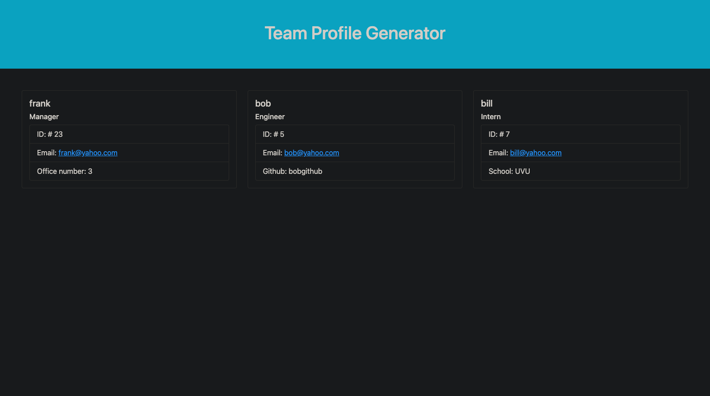

# Team-Profile-Generator

## Description

This project was build to be able to build and set up teams with based on their manager. It also contains their contact information. The user would  put the information in the prompts and get and html page generated with that persons team.

## Table of Contents

- [Installation](#installation)
- [Usage](#usage)
- [Function](#function)
- [Credits](#credits)
- [License](#license)

## Installation

You can install this by opening up the page on GitHub and cloning it to your computer using bash or terminal. Once cloned it can be opened up on VS Code.

Please see video link for a walk through on how to clone it.

[Clone to your computer](https://drive.google.com/file/d/15ogCY3Q-JLWhteoSiIoXLkhtK4Z0-mfz/view?usp=sharing "Click Me!")
  

## Usage

This project is to be used to make team profiles with their contact information.

To put your teams information in you go into git and put in {$ node index.js} and press enter. Then you just follow the prompts.

## License

---

## Tests

To test this application run { npm test } in bash

## Contact Me

Github profile: jamesfillerup
jamespfillerup@gmail.com